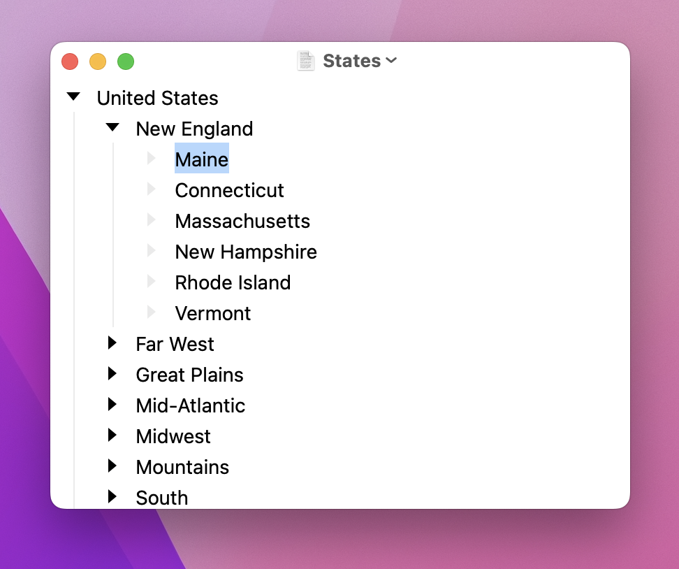

# Getting Started

Bike is an outliner. Items in Bike are organized into hierarchies. These hierarchies make up your outline. Above you can see that the Maine item is part of New England, and New England is part of the United States.

This United States outline is good to demonstrate outline structure. Your own outlines will likely look a bit messier. Use outlines to track ideas, projects, writing, to-do lists. More generally outliners are a great _tool for thought_.

#### To create an item

* Press the `Return` key to create an item

#### To change an item's indentation level

* Press the `Tab` key to indent an item
* Press `Shift-Tab` key to unindent an item

#### To show and hide detail in your outline

* Click an item's triangle handle to collapse an item, hiding it's children
* Click that same handle to expand the item, showing it's children

#### To focus into a specific part of your outline, hiding everything else

* Command-Click an item's handle
* Command-Click on a focused item's handle to unfocus it

That's it, just a few commands. Internalize these commands. _Learn the keyboard shortcuts_. Once you've done that Bike will be a great place for you to think.

Next I suggest you read:

* [Text Editing](using-bike/text-editing.md)
* [Outline Editing](using-bike/outline-editing.md)
