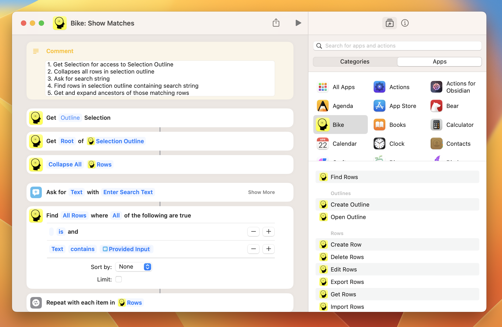
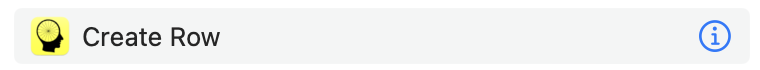

# Creating Shortcuts

Create shortcuts to automate Bike and integrate it with other apps. If you are just interested in runnings shortcuts that someone else has written please see the [Using Shortcuts](../using-bike/using-shortcuts.md) section.

<figure><figcaption>
Creating a Bike Shortcut
</figcaption></figure>

### Overview

When creating a Bike shortcut you will use Bike's provided actions to find and manipulate Bike's outlines and rows. In the above screenshot you can see a "Bike: Show Matches" shortcut that I'm creating.

### How to create shortcuts

Shortcuts are a general purpose automation technology. I'm not the best one to teach them! Here's Apple's getting started page:

* [Create a custom shortcut](https://support.apple.com/en-gb/guide/shortcuts-mac/apd84c576f8c/mac)

### How to use Bike actions

To create shortcuts for Bike you'll need to learn how to use Bike's actions. There are a few ways you can go about this.


No matter the approach, when experimenting with a shortcut that uses Bike, it's best to first open Bike and open a new outline where you can see the results of your experiments.


#### Just go for it

The best thing about shortcuts is that "Just go for it" is a viable choice. There is no syntax to learn. Just drag actions into a shortcut, run the shortcut, and see what happens. For example right now you could try dragging Bike's "Create Row" action into a shortcut. Run it!

#### Look at examples

If you get stuck an example or two can help. I've created a short tutorial and some example shortcuts \[here in this post]\([https://www.hogbaysoftware.com/posts/bike-automate-with-shortcuts/](https://www.hogbaysoftware.com/posts/bike-automate-with-shortcuts/)). More examples may be found on Bike's [extension wiki](https://support.hogbaysoftware.com/t/bike-extensions-wiki/4810). If you create a shortcut that you like please add it to the wiki for others to learn from.

#### Read the documentation

Each Bike shortcut action comes with documentation describing the input parameters and what (if anything) the shortcut returns. To view this documentation mouse over the action in the Shortcuts app and click the (i) information button as seen here:

<figure><figcaption>
Click the (i) to see detailed documentation
</figcaption></figure>
