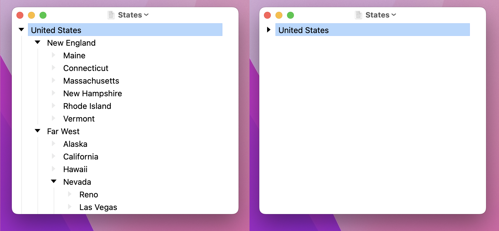
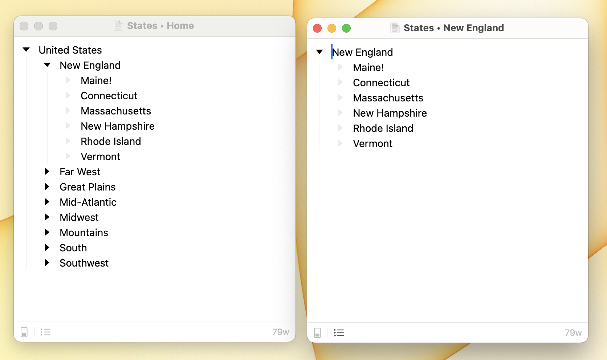

# Outline Viewing

Bike has two great ways to view big outlines:

1. Collapse items to see the big picture without being distracted by the details
2. Focus in to work on the details without being distracted by everything else

#### To collapse items in your outline

* Collapse Row (`Command-9`)
* Expand Row (`Command-0`)
* Collapse All (`Option-Command-9`)\
  Collapse the selected item and all items that it contains. This is a nice way to clean up a view, when you next expand the item its children will still be collapsed.
* Expand All (`Option-Command-0`)\
  Expand the selected item and all items that it contains. See the entire branch.

#### To focus into your outline

* Focus In (`Option-Command-Right`)
* Focus Out (`Option-Command-Left`)
* Home (`Shift-Command-H`)\
  Focus all the way out to the root level of your outline.

In [Outline Editing](outline-editing.md) mode you can use arrow keys to expand and collapse items
