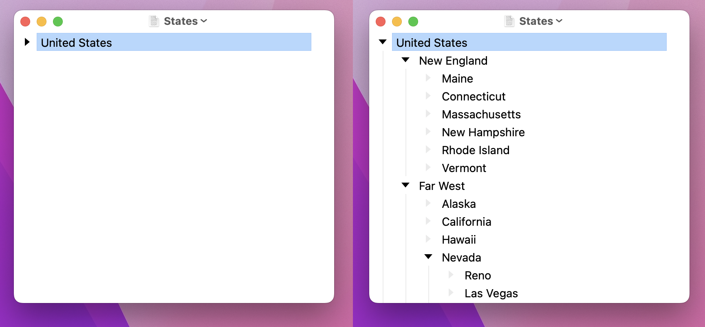

# Outline Viewing

#### To focus in and focus out in your outline

* Focus In (`Option-Command-Right`)
* Focus Out (`Option-Command-Left`)
* Home (`Shift-Command-H`)\
  Focus all the way out to the root level of your outline.

#### To expand and collapse items in your outline

* Expand Row (`Command-0`)
* Collapse Row (`Command-9`)
* Expand All (`Option-Command-0`)
* Collapse All (`Option-Command-9`)

In [Outline Editing](outline-editing.md) mode you can use arrow keys to expand and collapse items.
