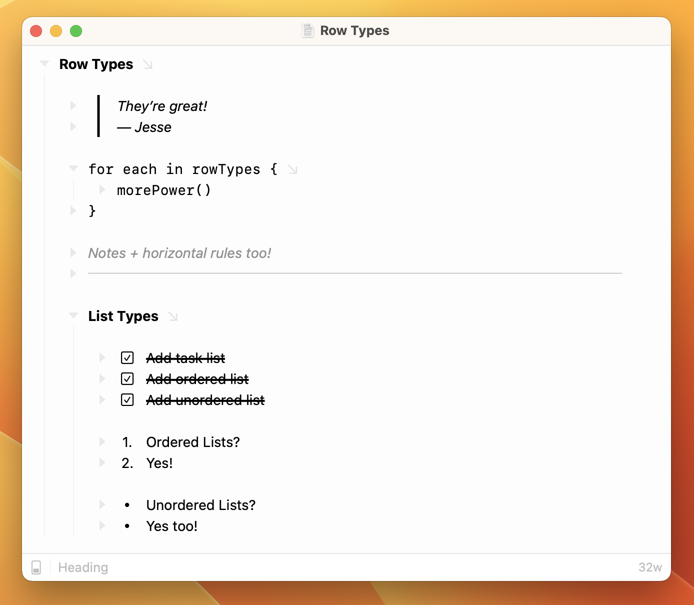

# Row Types

<figure><figcaption>
Row Types
</figcaption></figure>

Use row types to add another level of structure and meaning to your outlines. Add heading rows, task list rows, ordered list rows, and more.

### Using Row Types

The easiest way to use row types is through Bike's new "smart row types" feature. In a new row, type one of the following markdown inspired shortcuts--followed by a space:

| #                      | Heading         |
| ---------------------- | --------------- |
| >                      | Blockquote      |
| \`\`\`                 | Code Block      |
| :                      | Note            |
| ---                    | Horizontal Rule |
| \[], -\[], \[ ], -\[ ] | Task List       |
| 1.                     | Ordered List    |
| -, \*, +               | Unordered List  |

The shortcut text is replaced and the row type is set. Row types are supported in both `.bike` and `.opml` outlines. If smart row types are not working, make sure you have checked Settings > Autocorrect > Use smart row types.

#### Use the Formatting Popover

Use the same Formatting Popover (`Command-E`) that you use for text formatting to also set row types. Open the popover, and then press the down arrow to get a list of availible row types to choose from. This is fast, and you don't have to remember any of the row type completions described above.

#### Use the Format > Row menu

This is slower then the above methods. I've added this option mostly so that you can assign a keyboard shortcut for a specific row type. I think learning the smart row type completions described above is better for most people.

#### Tips and Tricks

To change a row's type back to "body" place your text caret at the start of the row and press delete. Once the row is a "body" row then delete will work normally.

To change a horizontal rule's row type back to "body" you can just start typing on the horizontal rule line.

The current row's type is indicated in the bottom status bar. You can also click this indicator to change the type.
