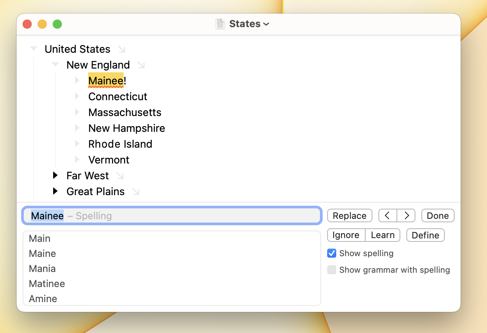

# Using Text Checking

Bike supports autocorrect, substitutions, user replacements, and spell checking. Bike's text checking interface is custom built, adopting and then improving upon macOS standard behavior.

* [Bike: Improved macOS text checking](https://www.hogbaysoftware.com/posts/bike-improved-text-checking)

## Spelling and grammar check

Bike will highlight spelling errors in your outline with a red zigzag underline. To fix a spelling error move the text caret to the end of the word. After a half second the text caret will bounce and a popup will show with a suggestion.

<figure><figcaption></figcaption></figure>

Sometimes text checking can't guess a word. In that case the text caret still bounce when it tries, but no popup will show. Then you'll have to fix the spelling manually. This happens to me quite often because I really can't spell, or even come close sometimes!

#### To find a text checking error

* Edit > Checking > Check Next (`Command-;`)
* Edit > Checking > Check Previous (`Command-:`)

These commands both select the found error and show the text checking panel. In the text checking panel you can also select suggestions and change text checking options.

### What is checked?

Checking will check the focused rows of your outline including collapsed rows. Check Next will expand collapsed rows to reveal and select the found error. Text that is code formatted will not be checked.

## Autocorrect

Autocorrect is a collection of features that replace text that you've typed with something else. For example autocorrect will capitalize the first word in a sentence, fix a spelling, or expand a user replacement.

Autocorrect is a challenging feature. While useful, it will always be wrong or unwanted some of the time. Bike accounts for this by making autocorrect predictable, visible, and reversible.

### Predictable

In Bike autocorrect always happens when you end a word by typing a character such as a space, a period, or a question mark.

Bike's autocorrect depends on current text caret position and the surrounding text. It doesn't take previous text caret positions into consideration.

You might be used to avoiding autocorrect by typing the sequence Right Arrow followed by Left Arrow. That won't work in Bike since autocorrect doesn't depend on previous caret positions.

In Bike just type. If a bad autocorrection happens use the Delete key to reverse it. Bike's approach requires fewer keystrokes and is more predictable.

### Visible

Autocorrect replaces what you've typed with something else. Often this is helpful, but sometimes it is wrong. Bike makes each autocorrection easy to spot so you won't be surprised later.

In Bike all autocorrected text is underlined with a blue zigzag line. This underline remains visible until you start typing a new word. If you move back into the original word the autocorrections will show again.

### Reversible

Bike makes undoing the previous autocorrect easy.

Press the Delete key and the autocorrect is reversed. You can also use undo (`Command-z`), but I find Delete to be faster. There is a preference to disable this special Delete behavior if you don't like it.

You can also reverse an autocorrections by placing the text caret at the end of the corrected text. A popup will show allowing you to reverse that correction.

## Text checking panel

To show the text checking panel use Edit > Checking > Show Checking or use the Check Next or Check Previous commands. They also show the text checking panel.

#### To select a correction

* Press the `Down` arrow to select any suggestion
* Or type your own correction into the text field

#### To apply a correction and find the next

* Click the `Replace` button in the checking panel
* Or press `Return` to apply the correction

#### To apply a correction and return to work

* Press `Option-Return` to apply the correction and return to work

#### To hide the checking panel

* Click the `Done` button in the checking panel
* Or press the `Escape` key

### Checking panel options

* _Show spelling_: Use macOS spell checker to perform spell checking, highlighting problems in your outline.&#x20;
* _Show grammar with spelling_: Use the macOS spell checker to perform grammar checking, highlighting problems in your outline.

### Autocorrect options

Autocorrect options are accessible in the Bike > Settings > Autocorrect settings panel. Autocorrect options all apply only as you are typing. For example if you paste text into an outline that text is not autocorrected.
