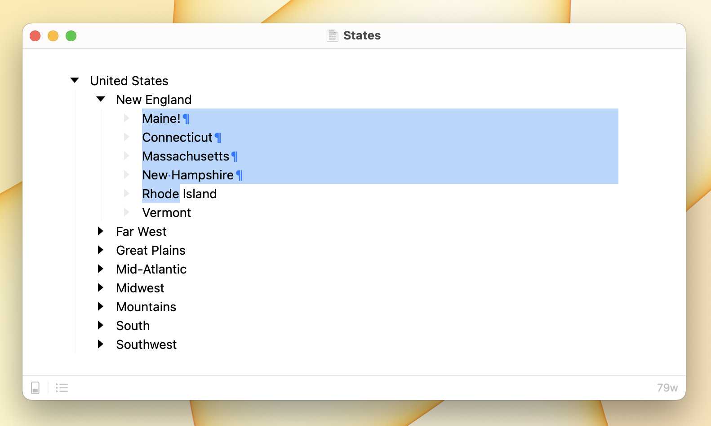

# Text Editing

Text editing should work as you expect. This is a nice feature of Bike. Often outliner apps constrain text editing in various ways. Bike doesn't do that.

### Bike Text Editing

Bike also adds a few new text editing commands.

Selection commands:

* Selection > Select World (`Control-W`)\
  Expand selection to word boundaries.
* Selection > Select Sentence (`Control-S`)\
  Expand selection to sentence boundaries.
* Selection > Select Paragraph (`Shift-Command-L`)\
  Expand selection to paragraph boundaries.
* Selection > Select Branch (`Shift-Command-B`)\
  Expand selection to branch boundaries.
* Selection > Expand Selection (`Option-Command-Up`)\
  Expand the selection up through the different boundary levels.
* Selection > Contract Selection (`Option-Command-Down`)\
  Undo previous Expand Selection command.

Item commands:

* Item > Insert Item (`Command-Return`)\
  This is similar to pressing `Return`. The difference is that it will always just insert a new item. Pressing `Return` will replace the selection with a newline to create the new item.&#x20;
* Item > Duplicate (`Command-D`)
* Item > Indent (`Control-Command-Right`)
* Item > Outdent (`Control-Command-Left`)
* Item > Move Up (`Control-Command-Up`)
* Item > Move Down (`Control-Command-Down`)


Indent and Outdent are important and used frequently. There are multiple keyboard shortcuts to perform these two commands. First you can use `Tab` and `Shift-Tab`as described in [Getting Started](<../README (1).md>). Second you can use the above arrow key based shortcuts. Third you can use `Command-]` and `Command-[`.



In text editing mode, these commands all work on individual items, unconstrained by the outline structure. This is as you would expect in a text editor, but maybe different than you would expect if you are used to outliners. See [outline editing](outline-editing.md) for outline editing behavior.

