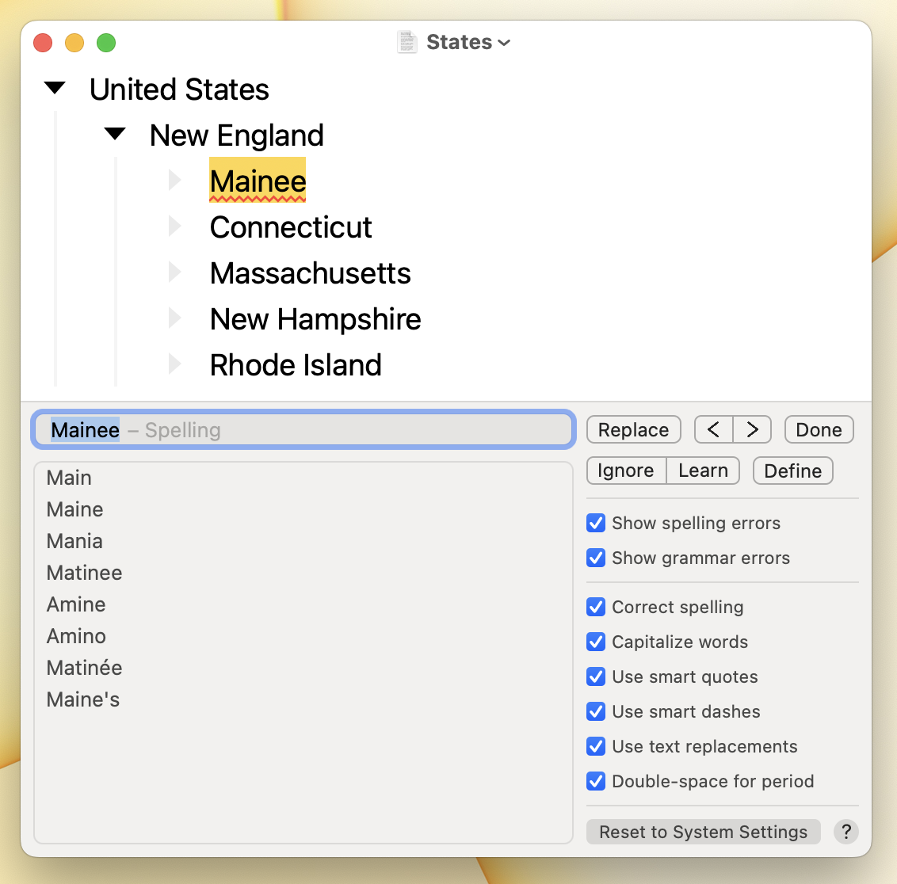

# Using Check Panel

* To show the checking panel and find the next suggestion use the menu item Edit > Checking > Check Next (`Command-;`)
* To show the checking panel and find the previous suggestion use the menu item Edit > Checking > Check Previous (`Command-:`)&#x20;
* To hide the checking panel press the `Escape` key.

When an issue has been found the text will be highlighted in your outline and that same text will be showing in the checking panel text field. From that point you can:

1. Use Check Next to skip to the next issue.
2. Press the `Down` arrow to select a suggestion. Then press the `Return` key to accept the suggestion and find the next issue.
3. Type your own replacement into the text field and press `Return` to replace and find the next issue.
