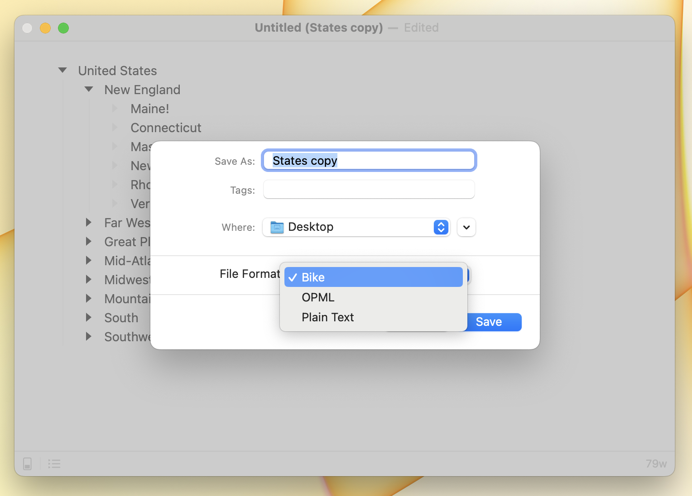

# Using Documents

From macOS User Guide:

* [Open documents](https://support.apple.com/guide/mac-help/open-documents-mchl971293e1/12.0/mac/12.0)
* [Create and work with documents](https://support.apple.com/guide/mac-help/create-and-work-with-documents-mchldc1dd114/12.0/mac/12.0)
* [View and restore past versions of documents](https://support.apple.com/guide/mac-help/view-and-restore-past-versions-of-documents-mh40710/12.0/mac/12.0)

### Format Options

`.bike`: This is Bike's native format and the one I would recommend using. It supports all Bike features. It is also an HTML document–you can view Bike files in your web browser.

`.opml`: This is a standard format for saving outlines. Use `.opml` if you wish to edit your outline with Bike and another OPML compatible outliner.

`.txt`: Bike can also work with plain text files. The outline structure is determined by the leading tab indentation. Text files don't offer any good place to store metadata (such as item ids). For this reason some features (such as links to items) will break when you close and then reopen a `.txt` based outline.
