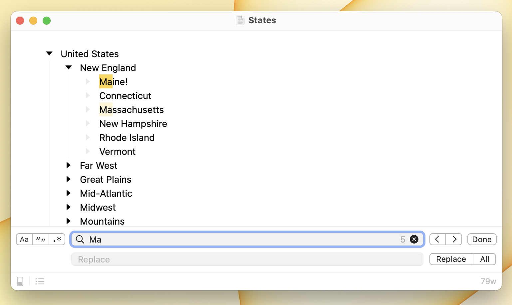

# Using Find Panel

Use the find panel to find text in your outline.

Find will search your entire outline if you haven't focused into a specific branch. If you have focused your outline then Find will only search that focused region. Find will always search into collapsed items and will expand them to show Find Next results.

* To show the find panel use the menu item Edit > Find > Find (`Command-F`)
* To hide the find panel press the `Escape` key, or click the Done button.

Type into the find panel's search field and matches are highlighted. The current match is highlighted in a brighter color.


When you first start searching there will be no current match. You must Find Next to set the current match. The Replace command isn't available until you have set a current match.


#### To advance to the next match

* Click the Next button in the find panel
* Or use Edit > Find > Find Next (`Command-F`)

#### To go back to the previous match

* Click the Previous button in the find panel
* Or use Edit > Find > Find Previous (Shift-Command-F)

#### To replace the current match with the contents of the replace field

* Click the replace button
* Or press the `Return` key when the replace field has keyboard focus

#### To replace all matches

* Click the replace all button. Remember this will only replace all matches in the current focused region of your outline.
