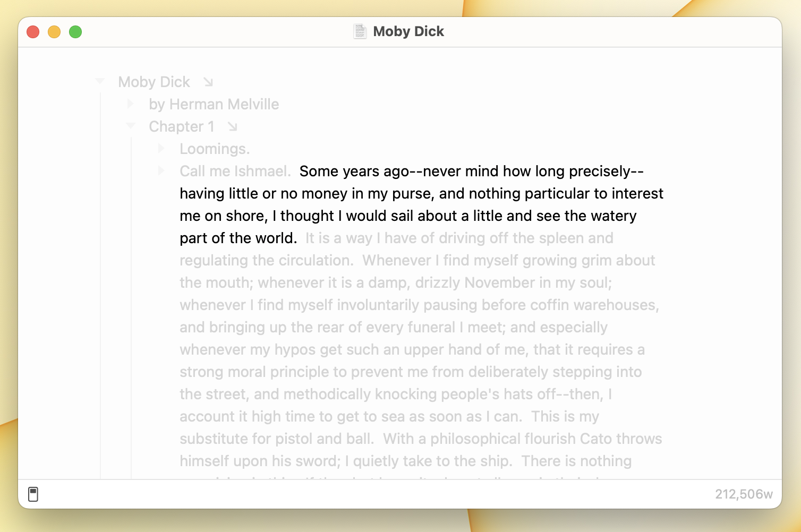

# Using Focus Mode

<figure><figcaption>
Focus Mode
</figcaption></figure>

Focus Mode focuses the current word, sentence, or paragraph by diming out the rest of your outline. It's especially useful combined with [full screen mode](using-full-screen-mode.md) and [typewriter mode](using-typewriter-mode.md).

#### To enable focus mode

* View > Focus Mode > Enable Focus (`Option-Command-F`)
* Alternatively you can use the "Options" menu on the left side of the status bar

#### To configure focus mode

* View > Focus Mode > Focus Word
* View > Focus Mode > Focus Sentence
* View > Focus Mode > Focus Paragraph

#### To disable focus mode

* View > Focus Mode > Disable Focus (`Option-Command-F`)
* Alternatively you can use the "Options" menu on the left side of the status bar
