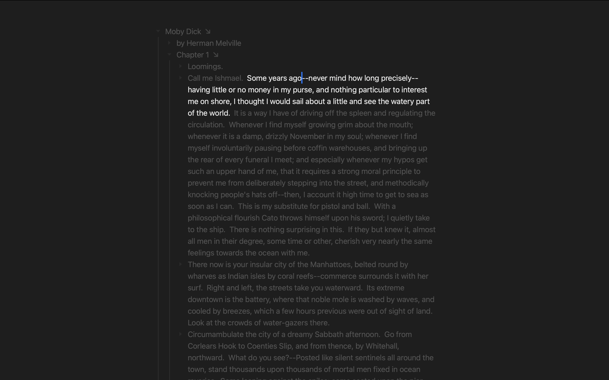

# Using Full Screen Mode

<figure><figcaption>
Full Screen Mode
</figcaption></figure>

Full Screen Mode expands your outline editor window to fill the entire screen. It's great for blocking out distractions and is especially useful combined with [text wrap](using-text-wrap.md), [focus mode](using-focus-mode.md), and [typewriter mode](using-typewriter-mode.md).

#### To enter full screen mode

* View > Enter Full Screen (`Control-Command-F`)
* Alternatively click the green window button and choose "Enter Full Screen"

#### To exist full screen mode

* View > Exit Full Screen (`Control-Command-F`)
* Alternatively click the green window button and choose "Exit Full Screen"
