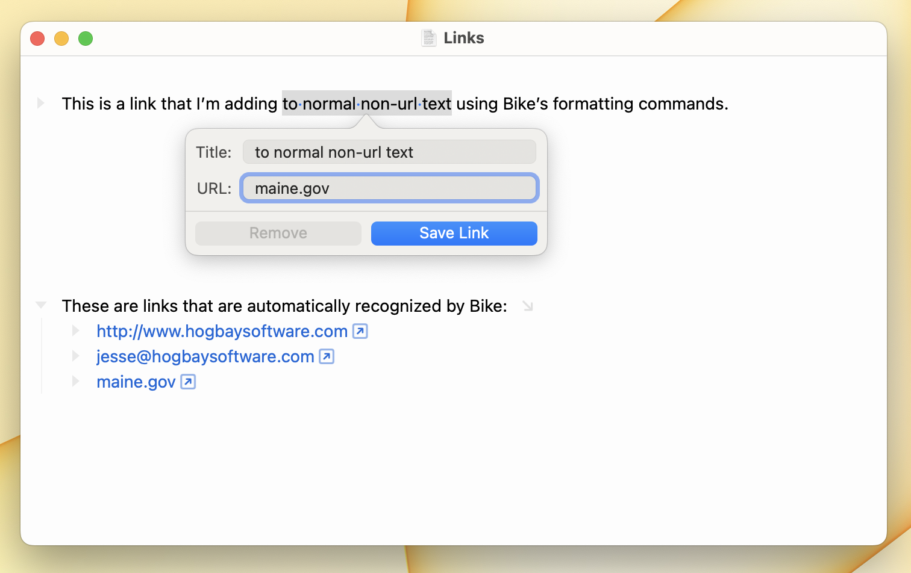

# Using Links



Bike allows you to insert links into your outline.

Bike also automatically detects URLs that you type.

Anytime there is a link in your document Bike will insert a "link button" after that link.

* Click the link button to activate the link.
* Or use Go > Open Link (`Command-Shift-O`) to activate links.
* Click and edit the link text without fear that you'll activate the link.
* To edit the URL associated with a link right click on the link text or link button and choose "Edit Link" from the popup menu.

More information on formatting and activating links can be found in the [text-formatting.md](text-formatting.md "mention") section.

### Bike Row Links

Bike includes its own link type that allows you to link directly to a row in your outline. When activating a Bike link you can:

* `Command-Click` to open a Bike link in a new tab
* `Command-Option-Click` to open a Bike link in a new window

Bike links are normal URLs. You can paste them into other apps and they'll continue to work as long as Bike is installed on your computer. For example you can paste a Bike link into Apple's Notes app and when you click that link it will open Bike and select the linked row.

Bike links have this pattern:

```
bike://<rootid>/<focusid>#<selectid>
```

* `<rootid>` The id of the root node of the document that you are linking too.
* `<focusid>` The id of the row that should be focused after activating the link. This is optional.
* `<selectedid>` The id of the row that should be selected after activating the link. This is optional.

Here's what an actual Bike link looks like:

```
bike://KOcw9x9N/ch#zf
```

#### To create a Bike link:

* Use Format > Add Link to Row… `Command-Option-K` to quickly select a row and insert a link to that row. &#x20;
* Use Edit > Copy > Row Link `Shift-Command-C` to copy a link to the selected row. If your view is focused when you copy then the link will also include the focused row id.

Alternatively you can drag a row by its triangle handle and then hold down the `Control` key before releasing the mouse. A link to the dragged row will be inserted into your outline.

### Bike Path Row Links

Bike links also have an alternative form. Bike path row links use a file path to locate the associated outline file instead of using the outline's id.

This is a Bike path link:

```
bike:///Users/jessegrosjean/Documents/todo.bike#aF
```

Path row links are more likely to break than standard Bike links. If you move or rename the linked to outline then the link will break. I generally recommend using normal Bike links.

#### To create a Bike path row link:

* Use Edit > Copy > Path Row Link to copy a path row link to the selected row.

### What if a link stops working?

Links can "break" for some obvious and non-obvious reasons.

* Create a link to a document and then delete that document. When you activate the link the document won't be found. This is probably not surprising!
* Create a link to a row in a document and then delete that row. When you activate the link the document will be opened, but you'll get a warning that the linked row could not be found.
* Bike uses Spotlight searches to resolve links. It associates the outline id with the document file and then searches for that id using Spotlight. This means if something is going wrong with Spotlight then your links won't work. This is a temporary problem, they will work again once the document id is again indexed with Spotlight.
* This association between a document file and root id is done by setting the `com.apple.metadata:kMDItemIdentifier` extended file attribute each time Bike saves a file. This means if a file's extended attributes are somehow lost then links to that file will break until next time the file is opened and saved through Bike.
* If you have two outline documents with the same outline id (for example if you duplicate an outline file) then links to that root id will open both documents.
