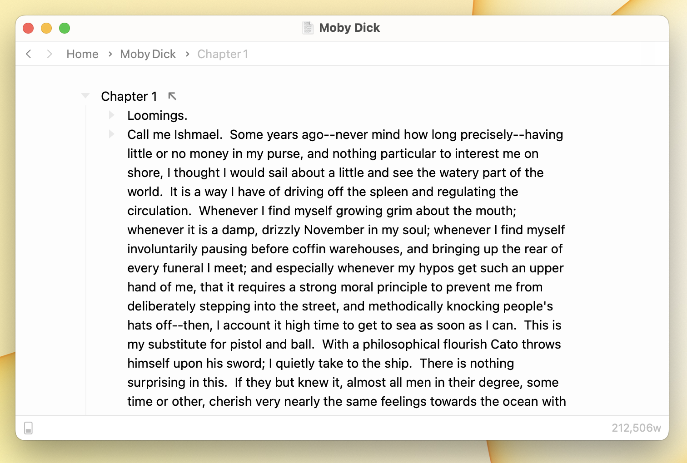

# Using Navigation Bar

<figure><figcaption>
Navigation Bar
</figcaption></figure>

Bike's optional navigation bar, at the top of the window, gives you quick access to back / forward buttons and navigation breadcrumb items that show you where you are focused in your outline.

Click the back button to go back to previously focused rows. Click a navigation breadcrumb item to show a menu, select a row, and focus into that row.

#### To show the navigation bar

* View > Show Navigation Bar (`Option-Command-/`)

#### To hide the navigation bar

* View > Hide Navigation Bar (`Option-Command-/`)
