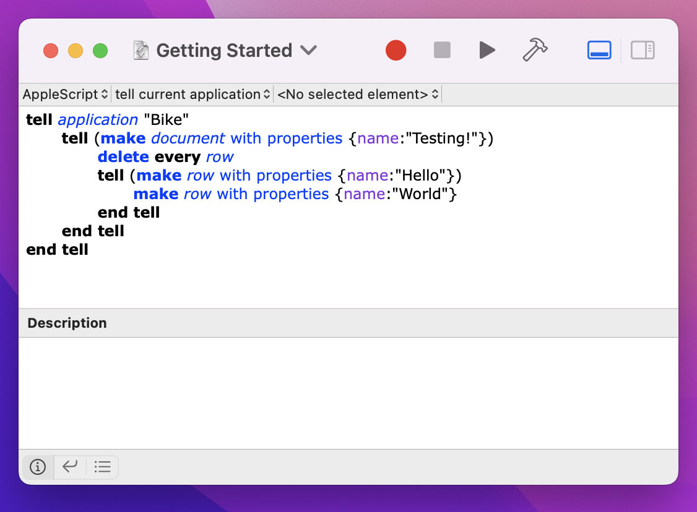

# Using Scripts

Use scripts to automate Bike and integrate with other apps.

#### To run a script:



1. Open the "Script Editor" application that comes with your Mac.
2. Paste the following script into a new editor window.
3. Make sure that the scripting language is set to "AppleScript".
4. Press the "Play" button to run the script. This script will create a new document named "Testing!". It deletes any welcome text that may be inserted into the document. Then it adds a "Hello" row to the document that contains a "World" row.

```
tell application "Bike"
  tell (make document with properties {name:"Testing!"})
    delete every row
    tell (make row with properties {name:"Hello"})
      make row with properties {name:"World"}
    end tell
  end tell
end tellScripting Overview
```

#### **To test a script given to you by someone else:**

I recommend that you first close your documents and create a new test document before running the script. You want to be sure that the script does what you want it to do, before you run it on your real work!

**To install a script in the system script menu:**

Open the "Script Editor" app and choose Help > Script Editor Help. Search for the help section "Access your scripts using the Script menu". That will lead you through the steps of enabling and saving scripts into the system script menu.

You can also use [FastScripts](http://www.red-sweater.com/fastscripts/) or [Keyboard Maestro](http://www.keyboardmaestro.com/main/) to run your scripts with assigned keyboard shortcuts.
