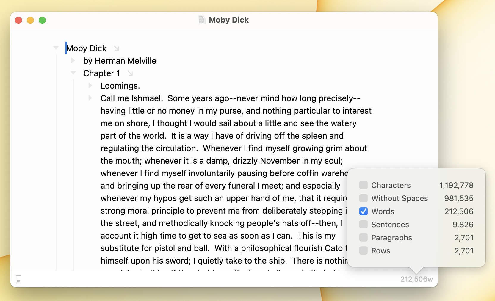

# Using Status Bar

<figure><figcaption>
Status Bar
</figcaption></figure>

Bike's optional status bar, at the bottom of the window, gives you quick access to options and text statistics. When an option is set the options button will highlight.

Text statistics are optionally shown in the status bar. To configure the statitics shown click the text statistics status item and check the statistics that you want to see. If no statistics are visible to click in the status bar then use View > Text Statistics to show the statistics popover.

#### To show the status bar

* View > Show Status Bar (`Command-/`)

#### To hide the status bar

* View > Hide Status Bar (`Command-/`)

