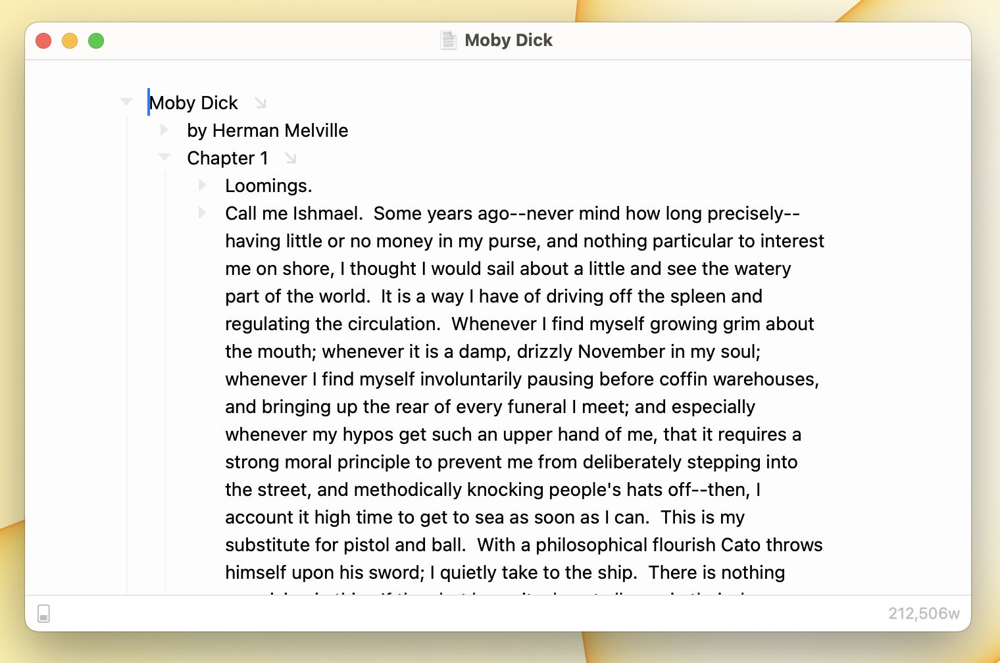

# Using Text Wrap

<figure><figcaption>
Text wrap adds margins
</figcaption></figure>

Text wrap limits the number of characters that your outline uses until the text wraps to the next line. When text is wrapping margins are added to keep the text centered in the window. You can see text wrap in effect in the above screenshot.

Text wrap will also scale your document to fit large windows. For example if you have text wrap enabled and then enter [fullscreen mode](using-full-screen-mode.md) you'll notice that the text is scaled larger to better fit your screen. If you wish to disable this scaling you can do so from Bike's editor settings.

#### To enable text wrap

* View > Text Wrap > Wrap to Column

#### To disable text wrap

* View > Text Wrap > Wrap to Window

