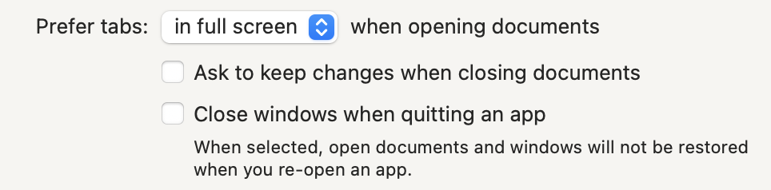

# Using Windows

From macOS User Guide:

* [Manage app windows](https://support.apple.com/guide/mac-help/work-with-app-windows-mchlp2469/12.0/mac/12.0)
* [Use tabs in windows](https://support.apple.com/guide/mac-help/use-tabs-in-windows-mchla4695cce/12.0/mac/12.0)
* [See open windows and spaces in Mission Control](https://support.apple.com/guide/mac-help/open-windows-spaces-mission-control-mh35798/12.0/mac/12.0)

### Bike Window Options

#### To make a window float above all other windows

* Check the menu item Window > Float on Top
* Uncheck that same menu item to restore normal behavior.

#### To open a single document in multiple windows

* Use the menu item File > New Window (`Option-Command-N`)
* Each window maintains its own selection, focused row, and expanded row.

### Bike Window Restoration

macOS has a standard feature that saves window "state" when you quit an application and restores that state when you next open the application. Bike uses this feature to save and restore the focused row, collapsed rows, and the selection.

To have your Bike windows restore state you need to do two things:

1. In macOS System Preferences > General make sure that the "Close windows when quitting an app" checkbox is _not_ checked. It should look like this: 
2. When you quit Bike you need to leave windows open that you want to be restored next time. If you close the windows before quitting Bike then no windows will be restored.
