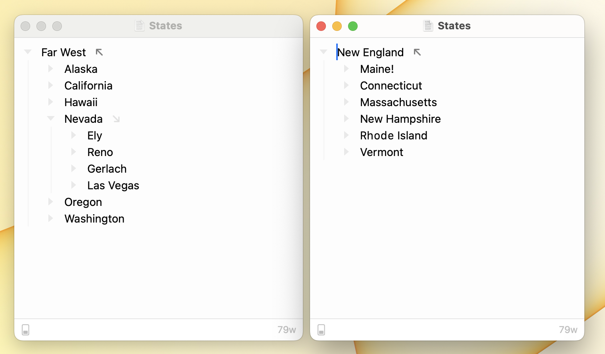
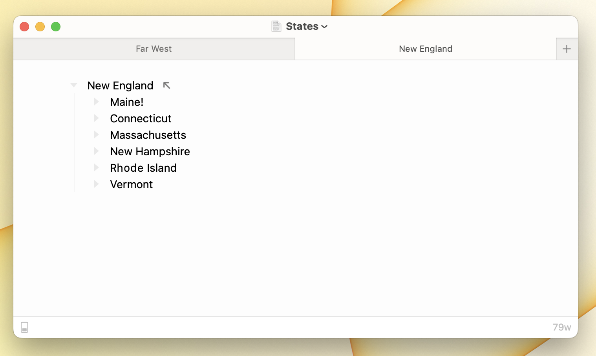

# Using Windows

From macOS User Guide:

* [Manage app windows](https://support.apple.com/guide/mac-help/work-with-app-windows-mchlp2469/12.0/mac/12.0)
* [Use tabs in windows](https://support.apple.com/guide/mac-help/use-tabs-in-windows-mchla4695cce/12.0/mac/12.0)
* [See open windows and spaces in Mission Control](https://support.apple.com/guide/mac-help/open-windows-spaces-mission-control-mh35798/12.0/mac/12.0)

### Bike Window Options

#### To make a window float above all other windows

* Check the menu item Window > Float on Top
* Uncheck that same menu item to restore normal behavior.

#### To open a single document in multiple windows

* Use the menu item Window > Duplicate Tab to New Window
* Each window maintains its own selection, focused row, and expanded row.

#### To open a single document in multiple tabs

<figure><figcaption>
Multiple Tab Views
</figcaption></figure>

* Use the menu item Window > Duplicate Tab
* Each tab maintains its own selection, focused row, and expanded row.

#### To open multiple document in a single window in separate tabs

* Use the menu item File > New Tab (`Option-Command-N`) to open a new untitled document in a new tab. (Must hold down `Option` to see that menu item.
* Use the menu item Window > Merge All Windows to merge all windows into a single window with multiple tabs.
* You can also drag existing tabs from window to window when the tab bar is visible. The tab bar is always visible if a window has multiple tabs... to make it visible when only a single tab is present use the menu View > Show Tab Bar.

### Bike Window Restoration

macOS has a standard feature that saves windows when you quit an application and restores them next time you open the application.

To have your windows restored you need to make sure that Bike doesn't close windows before it quits. There is a system setting for this "Close windows when quitting an app", but I have found that many users want to use a separate setting for Bike, without changing that system setting.

Bike no longer uses the system setting. Instead to leave windows open when quitting Bike you should open Settings > Document. And then make sure that "When quitting Bike: Close documents" is _not_ checked. After you've done that then Bike should restore your open windows and the focused row, collapsed rows, and the selection.

#### Bike "Secondary" Restoration

If standard macOS Window Restoration, described above, is not available then Bike will use secondary restoration. Secondary restoration restores only Bike outline state such as expanded rows, focused row, and selection.

